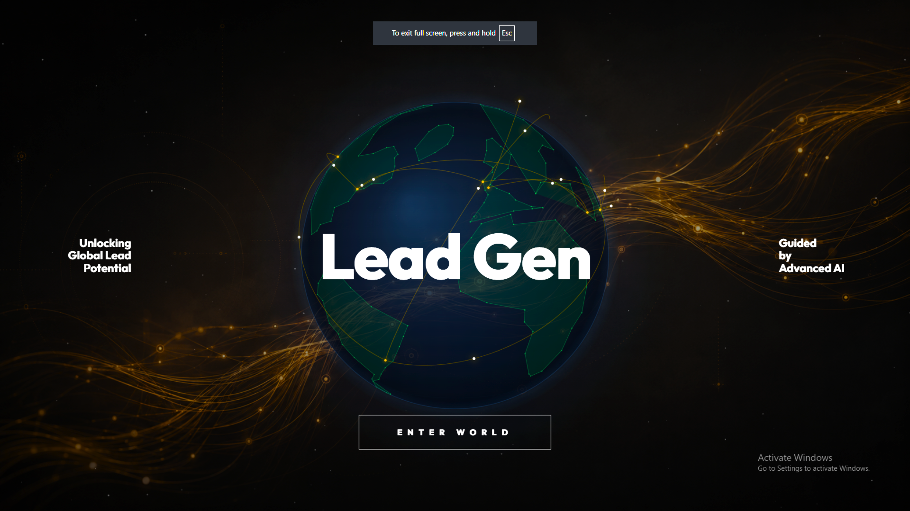
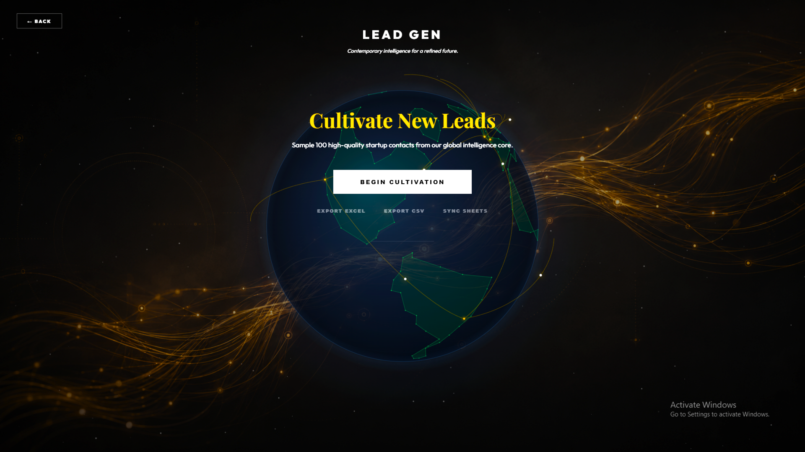
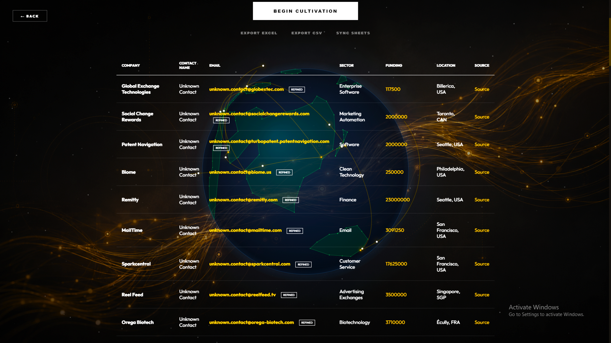

# 🌐Lead Gen

## ✧ Overview
Lead Gen is a sophisticated data cultivation engine designed to bridge the gap between raw global datasets and actionable business intelligence. It automates the extraction, enrichment and organization of lead data, transforming static CSV records into high-fidelity contacts through intelligent API integration and heuristic synthesis.

## ✧ Quick Glance
<p align="center">
  <br>
  <br>
  <br>
</p>

The project features a cinematic, glassmorphic dashboard with a custom-engineered 3D coordinate-projected globe, providing a premium visual interface for modern data operations.

## ✧ Key Pillars
### 1. Intelligence Core
The system utilizes a dual-source data architecture -
- **Global Intelligence Hub** - Processes extensive startup datasets (CSV) to identify high-potential targets based on funding, sector and location.
- **Dynamic Enrichment** - Interfaces with RESTful APIs (DummyJSON) to synthesize authentic contact personas for enriched lead profiles.

### 2. Heuristic Enrichment Engine
Beyond simple data collection, Lead Gen performs complex processing -
- **Email Synthesis** Generates professional email addresses using domain extraction and pattern-matching heuristics.
- **Data Sanitization** - Implements robust `pandas` pipelines to eliminate duplicates, standardize locations and handle missing telemetry.
- **Domain Validation** - Intelligently parses website URLs to ensure high-deliverability contact formats.

### 3. Museum-Grade Dashboard
Experience data like never before -
- **Custom 3D Globe** - A hand-crafted Canvas-based visualization projecting global lead density and data arcs in real-time.
- **Glassmorphic UI** - Contemporary design language featuring vibrant gold accents, sleek dark modes and fluid micro-animations.
- **Seamless Export** - One-click synchronization to Excel, CSV and Google Sheets.

### 4. Autonomous Operation
Enterprise-ready scheduling allows the engine to run hands-off - 
- **Automated Triggers** - Built-in scheduler for daily lead cultivation.
- **Production Ready** - Optimized for continuous data flow without manual intervention.

## ✧ Technical Architecture
| Layer | Technologies |
| :--- | :--- |
| **Backend Core** | Python 3.x, Flask |
| **Data Engine** | Pandas, Requests, OpenPyXL |
| **Automation** | Schedule |
| **Interface** | HTML5, Vanilla CSS3 (Custom Tokens) |
| **Visualization** | Canvas API (3D Coordinate Projection) |
| **Typography** | Outfit, Playfair Display |

## ✧ Quick Start

### 1. Prerequisites
Ensure you have Python 3.8+ installed on your system.

### 2. Installation
Clone the repository and install the high-performance dependencies -
```bash
pip install -r requirements.txt
```

### 3. Launching the Intelligence Dashboard
Start the web interface to begin manual cultivation -
```bash
python app.py
```

### 4. Running the Automation Engine
To activate the background scheduler for daily updates -
```bash
python lead_gen.py
```

## ✧ Data Pipeline Logic
1. **Extraction** - Loads `Dataset.csv` and filters for operating companies with active funding.
2. **Enrichment** - Maps contact identities from external API providers to company records.
3. **Synthesis** -
    - Extract domain from website URLs.
    - Generate `first.last@domain.com` email formats.
    - Standardize categories (e.g., "Uncategorized") and locations ("Location Undisclosed").
4. **Validation** - Removes records missing critical contact telemetry (Website/Funding).
5. **Persistence** - Serializes cleaned data to `.xlsx` and `.csv` formats.
